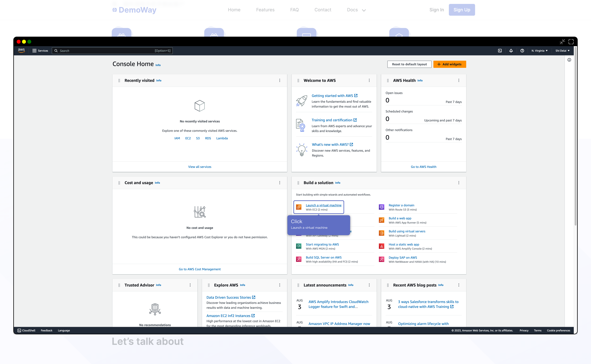
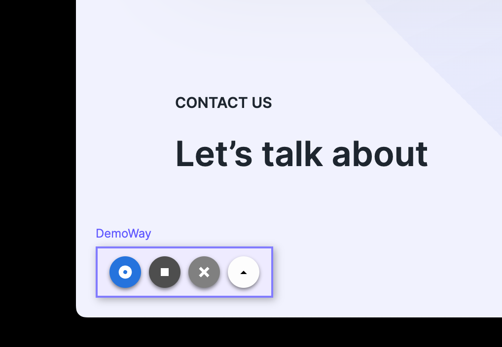

# Demoway SDK

## Install

### pnpm

```
pnpm add demoway-sdk
```

### npm

```
npm install demoway-sdk --save
```

### yarn

```
yarn add demoway-sdk
```

## Initialize DemoWay SDK

Initialize DemoWay SDK before application rendering

### Vue Example

```js
import { initialize } from 'demoway-sdk';
import { createApp } from 'vue';

initialize({
  accessToken: '', // getting from DemoWay dashboard
})
/**
* render your app
*/
createApp(App).mount();
```

### React Example

```jsx
import { initialize } from 'demoway-sdk';
import { createRoot } from 'react-dom/client';

initialize({
  accessToken: '', // getting from DemoWay dashboard
});

/**
* render your app
*/
const domNode = document.getElementById('root');
const root = createRoot(domNode);
root.render(<App />);
```

## Usage

### Open Demo in Dialog



Open a demo in dialog, which can switch to full screen mode.

```js
import { openDemoDialog } from 'demoway-sdk';

openDemoDialog('demo-id'); // demo-id can be got from DemoWay dashboard
```

### Open CheckList in Dialog

Open a checklist in dialog, which can switch to full screen mode.

```js
import { openDemoDialog } from 'demoway-sdk';

openDemoDialog('demo-id', {checklistId: 'checklist-id'}); // demo-id and checklist-id can be got from DemoWay dashboard
```

### Record a New Demo



Enable recording feature and show recording board by calling `enableRecord` function.

```js
import { enableRecord } from 'demoway-sdk';

// enable recording feature and show recording board
enableRecord();
```

Enable recording feature and show recording board by rage click.

```js
import { enableRecord, rageClick } from 'demoway-sdk';

const button = document.querySelector('button');

// rage click button 5 times with 1000ms interval
rageClick(button, 5, 1000).then(() => {
  // enable recording feature and show recording board
  return enableRecord();
});
```
